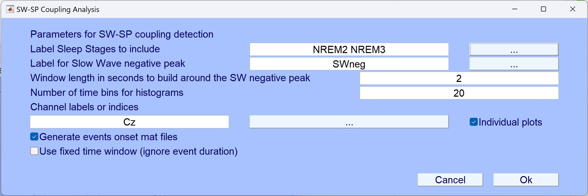

# SW-SP Coupling Toolbox for EEGLAB

## Overview
The **SW-SP Coupling Toolbox** is a MATLAB-based toolkit designed for detecting and analyzing **Slow Wave-Spindle (SW-SP) coupling** in EEG datasets. This toolbox integrates with **EEGLAB** and provides both a **Graphical User Interface (GUI)** and batch processing capabilities. It includes methods for detecting coupling events using **fixed time windows** and an **adaptive half-wave approach**.

## Features
- **Fixed Time Window Analysis:** Identifies spindle coupling within a predefined time window.
- **Adaptive Half-Wave Analysis:** Dynamically adjusts coupling detection based on individual slow wave durations.
- **Batch Processing:** Processes multiple EEG datasets simultaneously.
- **Event Onset Extraction:** Saves coupled and uncoupled event latencies for further analysis.
- **Statistical Summaries:** Aggregates results across subjects and computes coupling metrics.
- **Visualization Tools:** Generates time-domain plots, histograms, and statistical visualizations.
- **EEGLAB Integration:** Allows users to launch analyses directly from EEGLAB’s GUI.
- **Integration with Counting Sheep PSG Toolbox:** Expands the functionality for seamless sleep EEG analysis.
- **MRI-Compatible Outputs:** Converts event latencies to MRI time for multimodal studies.

## Installation
1. Ensure **MATLAB** (R2021+ recommended) and **EEGLAB** (v2021 or newer) are installed.
2. Simply unzip and copy 'SWSPcoupling' to '~/eeglab/plugins/'

## Usage
### 1. GUI Mode (EEGLAB)

1. Load an EEG dataset (`.set` file) in **EEGLAB**.
2. Navigate to `Tools > SW-SP Coupling Analysis`.
3. Configure parameters such as sleep stages, event labels, time windows, and channels.
4. Run the analysis and view results in EEGLAB.

### 2. Command Line Mode
Run the coupling detection on a single dataset:
```matlab
EEG = pop_SWSPcoupling(EEG);
```
For batch processing:
```matlab
batch_SWSPcoupling;
```

## Functions
| Function | Description |
|----------|-------------|
| `pop_SWSPcoupling.m` | EEGLAB GUI wrapper for SW-SP coupling analysis. |
| `batch_SWSPcoupling.m` | Batch processing script for multiple EEG datasets. |
| `SWSPcoupling_fix.m` | Detects SW-SP coupling using a fixed time window. |
| `SWSPcoupling_adapt.m` | Detects SW-SP coupling using an adaptive half-wave approach. |
| `extract_SWSP_onsets.m` | Extracts onset latencies and durations of coupling events. |
| `finalize_SWSP_results.m` | Aggregates and summarizes SW-SP coupling results. |
| `plot_SWSP_figures.m` | Generates visualizations of SW-SP coupling. |

## Output Files
- `.set` EEGLAB dataset file containing detection results.
- `.mat` and `.xlsx` files containing detection results.
- Summary report: `All_subjects_summary.xlsx`.
- Plots: `.tiff` and `.png` files visualizing SW-SP event distributions.
- **MRI-Compatible Onset Files:** Exports event latencies for fMRI studies.

## Citation
If you use this toolbox in your research, please cite:
> Baena, D., Ray, L.B., & Fogel, S.M. (2025).
> A novel adaptive time‑window method for detecting slow wave–spindle coupling:
> Comparison of temporal co‑occurrence and phase–amplitude coupling approaches.
> Journal of Neuroscience Methods, 422, 110526.
> https://doi.org/10.1016/j.jneumeth.2025.110526

## Contact
Author: **Daniel Baena**  
School of Psychology, University of Ottawa, Canada.
uOttawa Sleep Research Laboratory.
Email: dbaenape@uottawa.ca  
Affiliation: University of Ottawa  

## License
See the GNU General Public License v3.0 for more information.

Redistribution and use in source and binary forms, with or without modification, are permitted provided that the following conditions are met:

1. Redistributions of source code must retain the above author, license, copyright notice, this list of conditions, and the following disclaimer.

2. Redistributions in binary form must reproduce the above author, license, copyright notice, this list of conditions, and the following disclaimer in the documentation and/or other materials provided with the distribution.

THIS SOFTWARE IS PROVIDED BY THE COPYRIGHT HOLDERS AND CONTRIBUTORS "AS IS" AND ANY EXPRESS OR IMPLIED WARRANTIES, INCLUDING, BUT NOT LIMITED TO, THE IMPLIED WARRANTIES OF MERCHANTABILITY AND FITNESS FOR A PARTICULAR PURPOSE ARE DISCLAIMED. IN NO EVENT SHALL THE COPYRIGHT HOLDER OR CONTRIBUTORS BE LIABLE FOR ANY DIRECT, INDIRECT, INCIDENTAL, SPECIAL, EXEMPLARY, OR CONSEQUENTIAL DAMAGES (INCLUDING, BUT NOT LIMITED TO, PROCUREMENT OF SUBSTITUTE GOODS OR SERVICES; LOSS OF USE, DATA, OR PROFITS; OR BUSINESS INTERRUPTION) HOWEVER CAUSED AND ON ANY THEORY OF LIABILITY, WHETHER IN CONTRACT, STRICT LIABILITY, OR TORT (INCLUDING NEGLIGENCE OR OTHERWISE) ARISING IN ANY WAY OUT OF THE USE OF THIS SOFTWARE, EVEN IF ADVISED OF THE POSSIBILITY OF SUCH DAMAGE.
